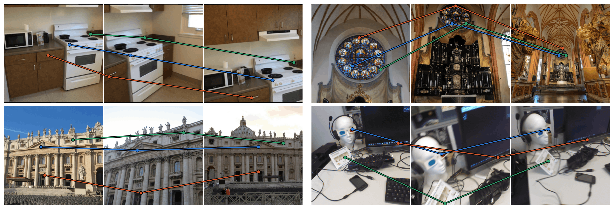
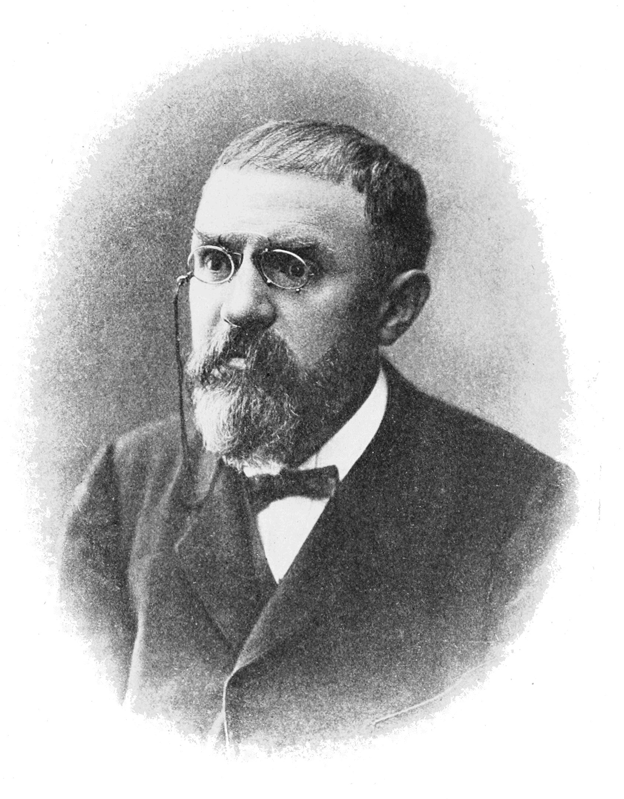

<div align="center">
<h1>Emergent Multi-View Geometry Through Self-Distillation</h1>

<a href="https://arxiv.org/abs/XXXX.XXXXX"></a>
<a href="https://pypi.org/project/poincar3/"></a>
<a href="https://www.davnords.com/poincar3"></a>

[David Nordström<sup>1</sup>](https://scholar.google.com/citations?user=-vJPE04AAAAJ), [Thibaut Loiseau<sup>2</sup>](https://scholar.google.com/citations?user=qDSlhTUAAAAJ), [Vincent Lepetit<sup>2</sup>](https://scholar.google.com/citations?user=h0a5q3QAAAAJ&hl),<br>[Michael Felsberg<sup>3</sup>](https://scholar.google.com/citations?user=lkWfR08AAAAJ), [Guillaume Bourmaud<sup>4</sup>](https://scholar.google.com/citations?user=d4v2IYMAAAAJ), [Fredrik Kahl<sup>1</sup>](https://scholar.google.com/citations?user=P_w6UgMAAAAJ)

<sup>1</sup> **Chalmers University of Technology**, <sup>2</sup> **Ecole Nationale des Ponts et Chaussées, IP Paris**,<br><sup>3</sup> **Linköping University**, <sup>4</sup> **University of Bordeaux, CNRS**
</div>

<p align="center">
    
    
    <br>
    <em>Left: Emerging matching capabilities from self-supervision. Simply using Poincar3's attention map reliable tracks can be created. Produced by <code>demo.py</code>. Right: Picture of Henri Poincaré, who argued that a being without motion cannot understand 3D space. Motivating our use of multi-view data.</em>
</p>

## Overview

We release a 3D foundation model, Poincar3, that learns multi-view geometry from only training on image sequences. Poincar3 uses a multi-view transformer and self-distillation, achieving strong zero-shot features and attention maps. For example, you can finetune our model for just 10K steps on one GPU and get 65+ AUC@30 on RE10K, whereas training from scratch gives around 5 AUC@30.

## Updates
- [September 30, 2026] Poincar3 public code release.

## Install

```bash
uv add poincar3          # or: pip install poincar3
```

The model itself needs only `torch`. Extras pull in what the scripts need:

```bash
uv add "poincar3[demo]"     # demo.py
uv add "poincar3[train]"    # training, mvcorr and SeeSE3 evals
uv add "poincar3[eval]"     # + matchbench and feed-forward reconstruction
```

To work from a clone instead (tested on Linux with Python 3.12):

```bash
uv sync --extra eval
```

## Usage

The checkpoint auto-downloads on first use:

```python
import torch
from poincar3 import Poincar3

model = Poincar3().eval().cuda()

# A multi-view batch: [batch, frames, 3, H, W], RGB in [0, 1], H and W multiples of 16.
images = torch.rand(1, 4, 3, 448, 448).cuda()

with torch.no_grad():
    patch_logits, patch_features, global_logits, camera_tokens = model(images)

# patch_features:  [1, 4, 784, 1024]  dense per-frame tokens, cross-view attended
# camera_tokens:   [1, 4, 1024]       one per-frame scene/pose token
```

### Demo

We illustrate how to create attention tracks by simply running:
```bash
uv run python demo.py
```
We also provide code for plotting the raw feature correlations in `cross_correlations.py`.

## Pretrained weights

The backbone auto-downloads on first use. You can find it directly [here.](https://github.com/davnords/storage/releases/download/poincar3/poincar3.pth)

## Evaluation

All evaluations, except feed-forward reconstruction, can be accessed through the `experiments/eval.py` endpoint. You can get ScanNet and NAVI following [these](https://github.com/mbanani/probe3d/blob/main/data_processing/README.md) instructions. To get the possible configurations, simply run it with the flag --help. For example, you run multi-view correspondence estimation on scannet by:
```bash
uv run python experiments/eval.py --evaluation mvcorr --mvcorr.dataset scannet
```

### Feed-forward reconstruction

Camera-pose and per-pixel-depth heads on top of the backbone, under two protocols (we train on 4xH200):

```bash
# full finetune
torchrun --nproc-per-node 4 experiments/ffrecon/train.py --name finetune-poincar3

# frozen backbone + a small adapter
torchrun --nproc-per-node 4 experiments/ffrecon/train_adapter.py --backbone poincar3

# relative pose evaluation
uv run python experiments/ffrecon/eval.py --checkpoint <path> --evaluation relpose --relpose.dataset megadepth
# point-cloud estimation
uv run python experiments/ffrecon/eval.py --checkpoint <path> --evaluation pointcloud --pointcloud.dataset eth3d
```
We also provide the pretrained checkpoints directly, you can use by `experiments/ffrecon/eval.py --checkpoint <file>`, and find them here:
| checkpoint | protocol | backbone | RE10K AUC@30 |
|---|---|---|---|
| [`poincar3_ffrecon_finetune.pth`](https://github.com/davnords/storage/releases/download/poincar3/poincar3_ffrecon_finetune.pth) | full finetune | Poincar3 | 0.682 |
| [`poincar3_ffrecon_finetune_dinov3_init.pth`](https://github.com/davnords/storage/releases/download/poincar3/poincar3_ffrecon_finetune_dinov3_init.pth) | full finetune | DINOv3 init | 0.312 |
| [`poincar3_ffrecon_finetune_random_init.pth`](https://github.com/davnords/storage/releases/download/poincar3/poincar3_ffrecon_finetune_random_init.pth) | full finetune | random init | 0.174 |
| [`poincar3_ffrecon_adapter.pth`](https://github.com/davnords/storage/releases/download/poincar3/poincar3_ffrecon_adapter.pth) | frozen + adapter | Poincar3 | 0.622 |
| [`dinov3_ffrecon_adapter.pth`](https://github.com/davnords/storage/releases/download/poincar3/dinov3_ffrecon_adapter.pth) | frozen + adapter | DINOv3 | 0.291 |
| [`mum_v1_ffrecon_adapter.pth`](https://github.com/davnords/storage/releases/download/poincar3/mum_v1_ffrecon_adapter.pth) | frozen + adapter | MuM v1 | 0.401 |

## Training

We pretrain Poincar3 on 8xH200 for 3 days. We run the command:
```bash
torchrun --nproc-per-node 8 experiments/train.py --name my-run
```

### Training data

While we trained on large collection of 3D datasets, we illustrate our training protocol on [ScanNet++](https://scannetpp.mlsg.cit.tum.de/scannetpp/) and [RealEstate10K](https://google.github.io/realestate10k/). You can download them using their official download links.  

## License

MIT, except where a file notes otherwise. `src/poincar3/layers/` and parts of `heads/` derive
from [DINOv3](https://github.com/facebookresearch/dinov3) and
[VGGT](https://github.com/facebookresearch/vggt) and carry their original licenses;
`benchmarks/mv_consistency/` is adapted from [probe3d](https://github.com/mbanani/probe3d) (MIT).

## Acknowledgement

Built on [DINOv3](https://github.com/facebookresearch/dinov3),
[DINOv2](https://github.com/facebookresearch/dinov2),
[VGGT](https://github.com/facebookresearch/vggt),
[probe3d](https://github.com/mbanani/probe3d) and [RoMa](https://github.com/Parskatt/RoMa).

## FAQ

<details>
<summary>What data/compute did you use?</summary>

We pretrained our 650M multi-view transformer on 8xH200 for 3 days. The following datasets were used:
| Datasets | Type / Source | Weight | # Scenes |
|---|---|---:|---:|
| SpatialVID | Outdoor / Video | 1 | 176,749 |
| DL3DV | Mixed / Video | 1 | 10,000 |
| RealEstate10K | Indoor / Video | 1 | 7,850 |
| **MegaDepth** | Outdoor / MVS | 1 | 169 |
| AerialMD | Aerial / MVS | 1 | 124 |
| BlendedMVS | Aerial / Mesh | 1 | 493 |
| Hypersim | Indoor / Graphics | 1 | 393 |
| TartanAir v2 | Outdoor / Graphics | 1 | 46 |
| Map-Free | Object-centric / MVS | 1 | 397 |
| ScanNet++ v2 | Indoor / Mesh | 1 | 856 |
| FlyingThings3D | Outdoor / Graphics | 0.5 | 2,239 |
| ARKitScenes | Indoor / RGB-D | 0.1 | 5,047 |
| UnrealStereo4k | Outdoor / Graphics | 0.01 | 8 |
| Virtual KITTI 2 | Outdoor / Graphics | 0.01 | 5 |
| **Total** | | | **204,376** |

</details>

<details>
<summary>Can you show me training curves?</summary>

You can find full evaluation and training curves in the Appendix of the paper.

</details>

<details>
<summary>How do you prevent collapse?</summary>

Similarly to DINO, wew use Sinkhorn-Knopp and Koleo regularization. These ensure that the output distribution cannot be uni-modal over a batch, ensuring diversity of clusters and preventing collapse (see CAPI paper for a good explanation). 

</details>

Please feel free to email me directly at davnords@chalmers.se for any questions.

## BibTeX

```bibtex
TBD
```
